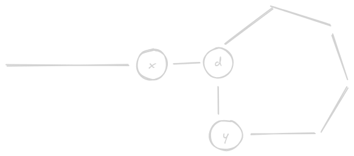

# Find the Duplicate Number

- https://leetcode.com/problems/find-the-duplicate-number/
- question says without modifying the array and in constant space
- however, if question only said constant space, use approach 1

## Approach 1 - Constant Space

- in such questions, if 1 to n is the integer range and array length is around that as well
- try to brainstorm how to modify the array such that 
  - the original array's element is retrievable
  - the array can be used as a hash map
- here, i add n to the element. this is an indicator that the element has been modified, since elements can only be 1-n range
- if we try to modify a modified element, the element is repeated - same hash computed twice
  
```java
class Solution {

    public int findDuplicate(int[] nums) {

        int n = nums.length - 1;

        for (int i = 0; i < nums.length; i++) {

            int element = nums[i] > n ? nums[i] - n : nums[i];
            
            if (nums[element] > n) {
                return element;
            } else {
                nums[element] += n;
            }
        }

        return -1;
    }
}
```

## Approach 2 - Constant Space and Without Modifying the Array

- we use floyd's algorithm
- note - seems like this is google favorite - came [here](./Happy%20Number.md) as well
- call the duplicate d
- for some x, `nums[x]` points to d
- for some y, `nums[y]` points to d
- and so, d is the entry point



- we already know how to find the "responsible node" for a cycle from [here](../Strivers%20A2Z%20DSA%20Course%20Sheet/Step%206:%20Learn%20LinkedList/Step%206.3:%20Medium%20Problems%20of%20LL/Find%20the%20starting%20point%20in%20LL.md) 

```java
class Solution {

    public int findDuplicate(int[] nums) {

        int hare = 0;
        int tortoise = 0;

        do {
            tortoise = nums[tortoise];
            hare = nums[nums[hare]];
        } while (hare != tortoise);

        hare = 0;

        do {
            tortoise = nums[tortoise];
            hare = nums[hare];
        } while (hare != tortoise);

        return hare;
    }
}
```
