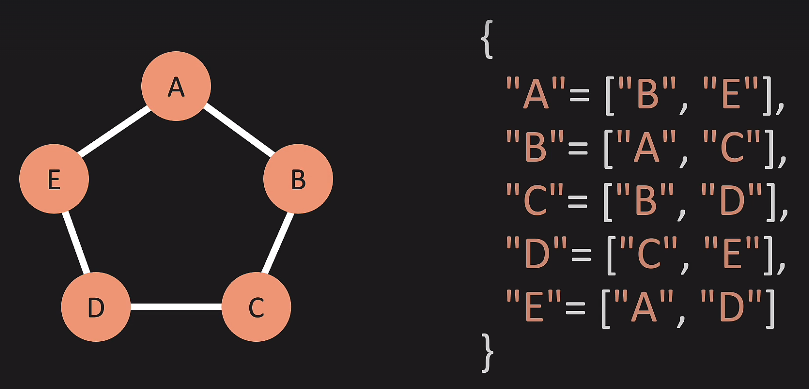

- we have nodes / vertices
- we also have edges
- edges can have weights or be non weighted
- edges can be unidirectional or bidirectional
- trees and linked lists are also a form of graphs
- adjacency matrix
  - represent the graph via a 2d matrix
  - if bidirectional, we will have a mirror image along the diagonal
  - if non weighted, we store 1s and 0s in the cells
  - if weighted, we store weights and 0s
- adjacency matrix space complexity - o(v^2)
- adding a vertex - o(v^2) - we have to add a new column and row to the 2d matrix
- adding an edge - o(1)
- removing an edge - o(1) - just mark as 0s in the matrix
- removing a vertex - o(v^2) - remove the row and column from the 2d matrix

- adjacency list - hash map - key is the vertex, value is the array list containing nodes having edges with the key
- adjacency list space complexity - o(v + e)
- adding a vertex - o(1)
- adding an edge - o(1)
- removing an edge - o(e) - iterate through the list
- removing a vertex - o(v + e)
  - remove the vertex from the hash map
  - check and remove the vertex from the array list of all other vertices
  - however, if graph is bidirectional, no need to go through all vertices - 
    - only remove from vertices present in "node to remove's" list

