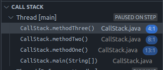

- each time the recursive logic that is run is the same
- but the problem becomes smaller each time
- the function is split into a recursive case and a base case
- **call stack** is made, and one by one the latest calls finish and are popped off the stack
- refer CallStack.java here, the stack in vscode looks like so - 
  
- the output - three two one (prints in the reverse order of calling, since it is a stack)
- this section also contains recursive binary search trees
- for insert and contains refer code, should be straightforward
- to remember for insert and delete - we return the node, and that gets set as the .left / .right. in most cases, it would be the same for the nodes, but in some case, it can change
- delete node - 
  - if left and right both are null return null
  - if only left is null return right
  - if only right is null return left
  - if neither are null - 
    - smallest value in right subtree - 
      - will be smaller than root of right subtree
      - will be greater than root of left subtree
      - so, it can act as a replacement for the current node
      - smallest node in the right subtree need not be a leaf node! its left would be pen, but right need not be. so, using the delete helper instead of trying to optimize might be good
    - by this logic, i feel like we could also have used the largest value in the lft subtree
