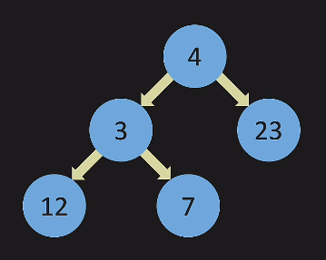
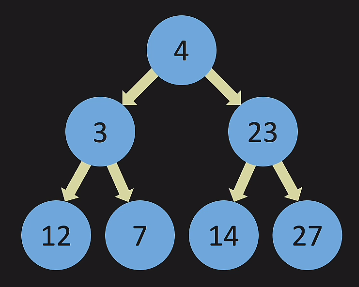
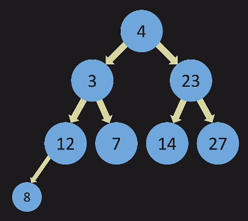
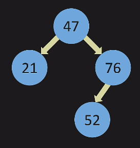

- tree - each node points to multiple nodes
- so, parent has pointers to children
- children with same parent are called siblings
- every node can only have one parent, not multiple parents - like multiple inheritance is not supported in java
- nodes with no children are called leaf nodes
- linked list was also a kind of tree
- binary tree - only left and right i.e. point to only two nodes
- full tree - every node either points to two or no nodes
  
- perfect tree - all nodes at all levels are filed all the way across (except the last level)
  
- complete tree - fill tree from left to right with no gaps in between
  
- binary search tree - lesser to left, greater than to the right
  
- number of nodes grows exponentially - 2^k - 1
  - if we have perfect tree of two levels, we have 2^2 - 1 = 3 nodes
  - if we have perfect tree of four levels, we have 2^4 - 1 = 15 nodes
- searching for a node in a perfect tree - o(log n), where n = number of nodes. reason - max steps to reach = number of levels = log n
- worst case - skewed i.e. a linked list. here, searching for a node will take n steps
- removing is o(n) in linked list, o(log n) in bst
- inserting (if tail is maintained at end) is o(1) in linked list, o (log n) in bst - so linked list is better here
- basically, bst can make use of the fact that there is some sorting unlike linked list
- this technique used by bst is also called "divide and conquer"
