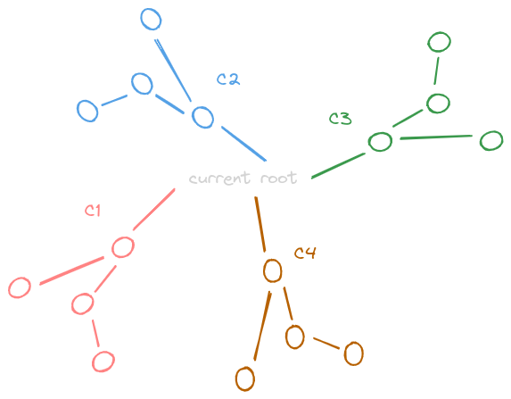

# Count Pairs of Connectable Servers in a Weighted Tree Network

- https://leetcode.com/problems/count-pairs-of-connectable-servers-in-a-weighted-tree-network/
- do dfs from all nodes, and find distance of all other nodes from this node
- now, each "neighbor" of this node corresponds to a component
- only consider nodes which have distance % signal speed = 0
- we basically need sum of products in pairs of all these components i.e. below, we need `(c1*c2) + (c1*c3) + (c1*c4) + (c2*c3) + (c2*c4) + (c3*c4)`



```java
class Solution {
    
    public int[] countPairsOfConnectableServers(int[][] edges, int signalSpeed) {

        int n = edges.length + 1;
        List<List<Edge>> graph = new ArrayList<>();
        for (int i = 0; i < n; i++) {
            graph.add(new ArrayList<>());
        }
        
        for (int[] edge : edges) {
            graph.get(edge[0]).add(new Edge(edge[1], edge[2]));
            graph.get(edge[1]).add(new Edge(edge[0], edge[2]));
        }
        
        int[] result = new int[n];
        
        for (int i = 0; i < n; i++) {
            
            boolean[] visited = new boolean[n];
            visited[i] = true;

            int color = 1;
            Map<Integer, Integer> map = new HashMap<>();

            for (Edge edge : graph.get(i)) {

                map.put(color, 0);
                visited[edge.neighbor] = true;
                
                dfs(edge.neighbor, visited, color, map, graph, edge.weight, signalSpeed);
                
                color += 1;
            }
            
            List<Integer> values = new ArrayList<>(map.values());
            
            for (int j = 0; j < values.size(); j++) {
                for (int k = j + 1; k < values.size(); k++) {
                    result[i] += values.get(j) * values.get(k);
                }
            }
            
            // System.out.println(map);
        }
        
        return result;
    }
    
    private void dfs(int node, boolean[] visited, int color, Map<Integer, Integer> map, List<List<Edge>> graph, int currentDistance, int signalSpeed) {
        
        if (currentDistance % signalSpeed == 0) {
            map.put(color, map.getOrDefault(color, 0) + 1);
        }
        
        for (Edge edge : graph.get(node)) {
            if (!visited[edge.neighbor]) {
                visited[edge.neighbor] = true;
                dfs(edge.neighbor, visited, color, map, graph, currentDistance + edge.weight, signalSpeed);
            }
        }
    }
    
    static class Edge {
        
        int neighbor;
        int weight;
        
        Edge(int neighbor, int weight) {
            this.neighbor = neighbor;
            this.weight = weight;
        }
        
        @Override
        public String toString() {
            return "(" + neighbor + "," + weight + ")";
        }
    }
}
```

- one small thing - i don't know how above solution did not give a tle, because feels O(n^3), which should not be accepted
- the problem is the calculation of the products in pairs - `c1*c2 + c1*c3 ...`
- a different way to look at this - `(c1*(sum - c1) + c2*(sum - c2) + c3*(sum-c3)....) / 2`
- so, rewriting that bit - 

```java
int sum = 0;

for (int value : values) {
    sum += value;
}

for (int value : values) {
    result[i] += (sum - value) * value;
}

result[i] /= 2;
```
