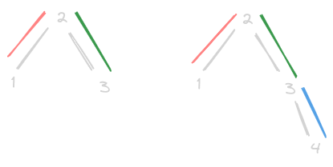

# Find the Maximum Sum of Node Values

- https://leetcode.com/problems/find-the-maximum-sum-of-node-values/
- observation - we can toggle values of "any pair" into x^k and y^k
- below - 
  - example 1 - we do 1,2 and 2,3 - 2 remains same
  - example 2 - we do 1,2 then 2,3 and 3,4 - 2 and 3 remain same



- so, if even number of elements have `nums[i]^k > nums[i]` - bless
- if odd - 
  - possibility 1 - pick one of the elements that should be xored and do not xor it
  - possibility 2 - pick one of the elements that should not be xored and xor it
- so, we maintain a minimum "compromise" - if no of xored elements % 2 is not 0, subtract this compromise from result

```java
class Solution {

    public long maximumValueSum(int[] nums, int k, int[][] edges) {

        int compromise = Integer.MAX_VALUE;
        long result = 0;
        int countOfXoredElements = 0;

        for (int i : nums) {
            if ((i ^ k) > i) {
                result += (i ^ k);
                countOfXoredElements += 1;
                compromise = Math.min(compromise, (i ^ k) - i);
            } else {
                result += i;
                compromise = Math.min(compromise, i - (i ^ k));
            }
        }

        if (countOfXoredElements % 2 == 1) {
            result -= compromise;
        }

        return result;
    }
}
```
