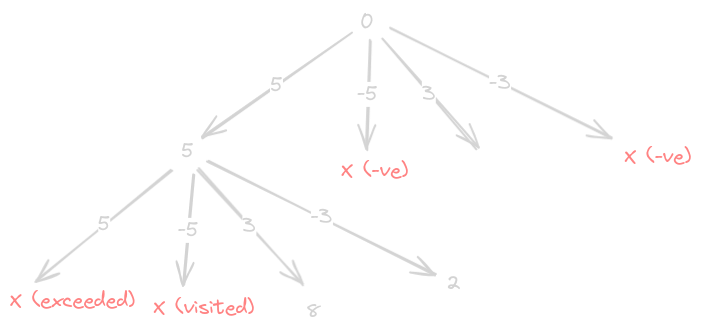

# Water and Jug Problem

- https://leetcode.com/problems/water-and-jug-problem/
- we have multiple possibilities from a state - 
  - if x is not full - make x full
  - if y is not full - make y full
  - if x is not empty - make x empty
  - if y is not empty - make y empty
  - if x is not full and y is not empty - transfer "some" y to x
    - some = min(empty portion of x, filled portion of y)
  - if y is not full and x is not empty - transfer "some" x to y
    - some = min(empty portion of y, filled portion of x)
- if any of the calls return true, just preemptively return true
- finally - we might end up cycling - we fill x -> empty x -> fill x -> empty x and so on
- so, we also maintain a visited which we check at the beginning of our recursive dfs - if already visited - just return false
- time complexity (my guess) - we can visit all states from 0,0 to x,y - our memoization of visited state ensures we visit a state only once. so, complexity = x + y

```java
class Solution {

    public boolean canMeasureWater(int x, int y, int target) {
        boolean[][] visited = new boolean[x + 1][y + 1];
        return recurse(0, 0, x, y, target, visited);
    }

    private boolean recurse(int x, int y, int capacityX, int capacityY, int target, boolean[][] visited) {

        if (x == target || y == target || x + y == target) {
            return true;
        }

        if (visited[x][y]) {
            return false;
        }

        visited[x][y] = true;

        if (x != capacityX) {
            if (recurse(capacityX, y, capacityX, capacityY, target, visited)) {
                return true;
            }
        }

        if (x != 0) {
            if (recurse(0, y, capacityX, capacityY, target, visited)) {
                return true;
            }
        }

        if (y != capacityY) {
            if (recurse(x, capacityY, capacityX, capacityY, target, visited)) {
                return true;
            }
        }

        if (y != 0) {
            if (recurse(x, 0, capacityX, capacityY, target, visited)) {
                return true;
            }
        }

        if (x != capacityX && y != 0) {
            int pour = Math.min(capacityX - x, y);
            if (recurse(x + pour, y - pour, capacityX, capacityY, target, visited)) {
                return true;
            }
        }

        if (x != 0 && y != capacityY) {
            int pour = Math.min(x, capacityY - y);
            if (recurse(x - pour, y + pour, capacityX, capacityY, target, visited)) {
                return true;
            }
        }

        return false;
    }
}
```

- now apparently, the problem can be rethought of a little as follows -
- we can go to 4 states - subtract x, subtract y, add x, add y
- note - while doing this, remove improbable states like total exceeding x + y, total going below 0, etc
- note - we would still need to use a similar visited array to prevent cycles as seen earlier



```java
class Solution {

    public boolean canMeasureWater(int x, int y, int target) {
        boolean[] visited = new boolean[x + y + 1];
        return recurse(x, y, 0, target, visited);
    }

    private boolean recurse(int x, int y, int current, int target, boolean[] visited) {

        if (current == target) {
            return true;
        }

        if (current < 0 || current > x + y) {
            return false;
        }

        if (visited[current]) {
            return false;
        }

        visited[current] = true;

        return recurse(x, y, current + x, target, visited) || 
            recurse(x, y, current - x, target, visited) || 
            recurse(x, y, current + y, target, visited) || 
            recurse(x, y, current - y, target, visited);
    }
}
```
