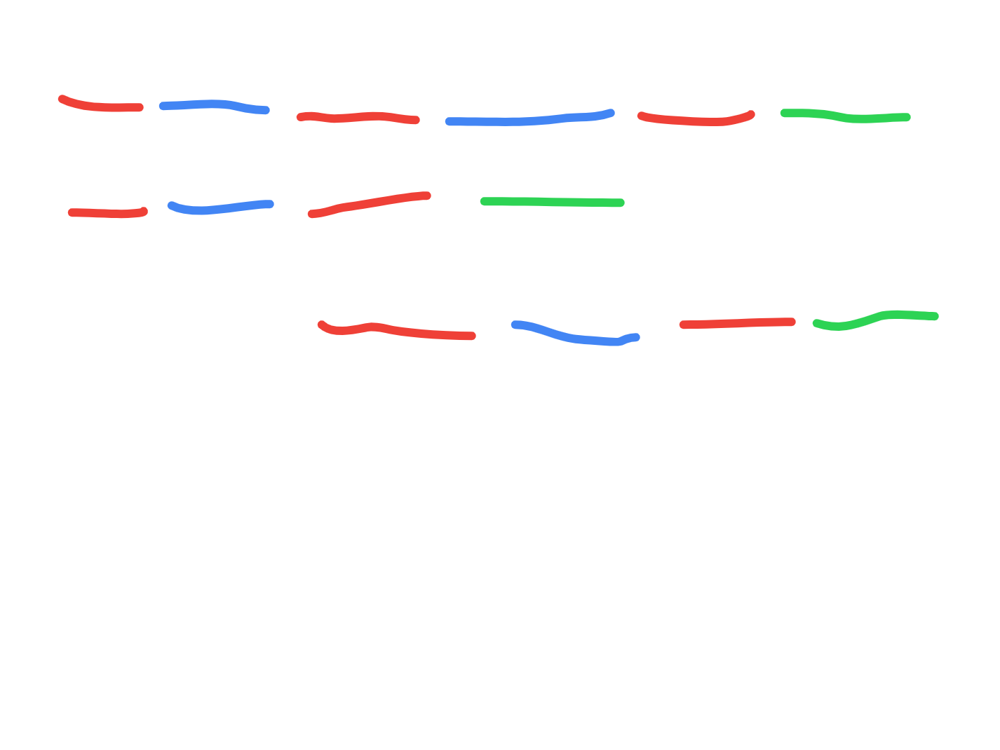

# KMP algo / LPS(pi) array

- https://leetcode.com/problems/find-the-index-of-the-first-occurrence-in-a-string/

## Brute Force

- time complexity - O(n * m)
- look at outer loop range carefully

```java
class Solution {
    public int strStr(String haystack, String needle) {
        
        for (int i = 0; i <= haystack.length() - needle.length(); i++) {
            int j = 0;
            while (j < needle.length()) {
                if (needle.charAt(j) != haystack.charAt(i + j)) {
                    break;
                }
                j++;
            }
            if (j == needle.length()) {
                return i;
            }
        }
        return -1;
    }
}
```

## KMP Algorithm

- let us say 1st 2nd and 3rd parts of the needle are the same
- initially, first three parts of the needle match the haystack
- but, it does not match from the beginning of the fourth part of the needle
- we know that first and third parts of the needle are the same
- kmp is "intelligent enough" to now match from the 4th part of haystack to 2nd part of needle
- this jump makes kmp efficient - since we did not have to rematch the part that had already matched
- the part - suffix thats also the prefix
- so, a good e.g. for interviews - 
  - needle - ab cd ab ef
  - haystack - ab cd ab cd ab ef



- we construct an array such that if for index i, value is x, it means `needle[0...x - 1]` = `needle[i - x - 1...i]`
- this array is called the "longest prefix suffix" - thats why the title has lps
- logic behind if - 
  - e.g. imagine we are at i, and character at i is same as character at prevLps
  - since prefix ending prevLps - 1 has already been checked with suffix ending at i - 1
  - thus `lps[i] = prevLps`
  - then, we increment i and prevLps
- logic behind else if - straight forward, nothing is matching
- logic behind final else - 
  - assume needle - aa bb aa x aa bb aaa
  - lps - 01 00 12 0 12 34 562
  - it tries matching aa bb aaa with aa bb aa x - cannot match last a with x
  - then tries matching starting aa b with aa a - cannot match last a with b
  - then tries matching starting aa with aa -  matches!
  - for all above cases - it only tries matching a with the character at prevLps - it does not try to match everything before prevLps - this is the advantage of kmp
- time complexity of building lps - `O(2 * n)`

```java
    private int[] getLps(String s) {

        int[] lps = new int[s.length()];
        int prevLps = 0;
        int i = 1;

        while (i < s.length()) {
            if (s.charAt(prevLps) == s.charAt(i)) {
                lps[i] = prevLps + 1;
                prevLps += 1;
                i += 1;
            } else if (prevLps == 0) {
                lps[i] = 0;
                i += 1;
            } else {
                prevLps = lps[prevLps - 1];
            }
        }

        return lps;
    }
```

- for matching - this example is good - 
  - haystack - aaa x aaay
  - needle - aaay
- first three a's match
- when x does not match y
- we compare x of haystack with the "third a" of needle
- notice how we did not have to compare the first two as of the needle with the two as before the x of haystack

```java
    private int findFirstIndex(int[] lps, String haystack, String needle) {
        
        int i = 0;
        int j = 0;

        while (i < haystack.length() && j < needle.length()) {
            if (haystack.charAt(i) == needle.charAt(j)) {
                i += 1;
                j += 1;
            } else if (j == 0) {
                i += 1;
            } else {
                j = lps[j - 1];
            }
        }

        return j == needle.length() ? i - j : -1;
    }
```
