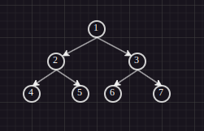

# Binary Tree Traversals in Binary Tree

## DFS

- depth first search
- inorder - left root right - 4 2 5 1 6 3 7
- preorder - root left right - 1 2 4 5 3 6 7
- postorder - left right root - 4 5 2 6 7 3 1

## BFS

- breadth first search
- 1 2 3 4 5 6 7
