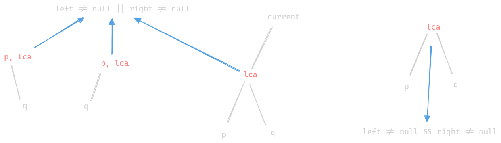

# Lowest Common Ancestor of a Binary Tree

- https://leetcode.com/problems/lowest-common-ancestor-of-a-binary-tree/



```java
class Solution {

    public TreeNode lowestCommonAncestor(TreeNode root, TreeNode p, TreeNode q) {
        
        if (root == null) return null;

        TreeNode left = lowestCommonAncestor(root.left, p, q);
        TreeNode right = lowestCommonAncestor(root.right, p, q);

        if (left != null && right != null) return root;
        else if (root == p) return root; // p is at root. lca "can be" at root if left / right had q
        else if (root == q) return root;  // q is at root. lca "can be" at root if left / right had p
        else if (left != null) return left;
        else if (right != null) return right;
        else return null;
    }
}
```
