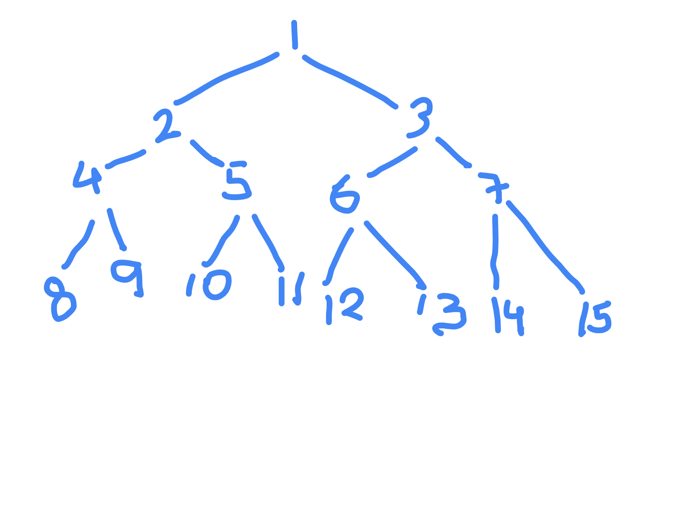
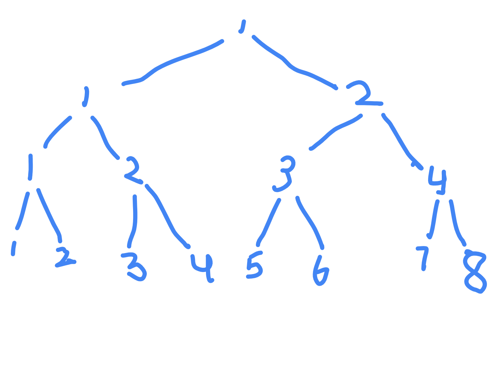

# Maximum Width of Binary Tree

- https://leetcode.com/problems/maximum-width-of-binary-tree/
- it actually means number of nodes between them when we do a level order traversal
- trick - number the nodes - left child is numbered 2x, right child is numbered 2x + 1
- so, subtract these numbers



- issue - imagine a skewed tree, with 10^5 nodes (left skewed) - the number will easily overflow very quickly - because 1st node would be 1, 2nd node 2, 3rd node 4 and so on
- trick - we try to make first node of the level start from 1 always - how? left child is 2x-1, right child is 2x. this way, nodes on all levels always start from 1



- notice the use of peekFirst and peekLast to calculate minimum and maximum tags

```java
class Solution {

    public int widthOfBinaryTree(TreeNode root) {

        if (root == null) return 0;

        Deque<QueueNode> queue = new ArrayDeque<>();
        queue.addLast(new QueueNode(root, 0));

        int width = 0;

        while (!queue.isEmpty()) {

            width = Math.max(width, queue.peekLast().val - queue.peekFirst().val + 1);
            int currentLevelSize = queue.size();

            for (int i = 0; i < currentLevelSize; i++) {

                QueueNode queueNode = queue.removeFirst();

                if (queueNode.node.left != null) {
                    queue.addLast(new QueueNode(queueNode.node.left, 2 * queueNode.val));
                }

                if (queueNode.node.right != null) {
                    queue.addLast(new QueueNode(queueNode.node.right, 2 * queueNode.val + 1));
                }
            }
        }

        return width;
    }

    static class QueueNode {

        TreeNode node;
        int val;

        QueueNode(TreeNode node, int val) {
            this.node = node;
            this.val = val;
        }
    }
}
```
