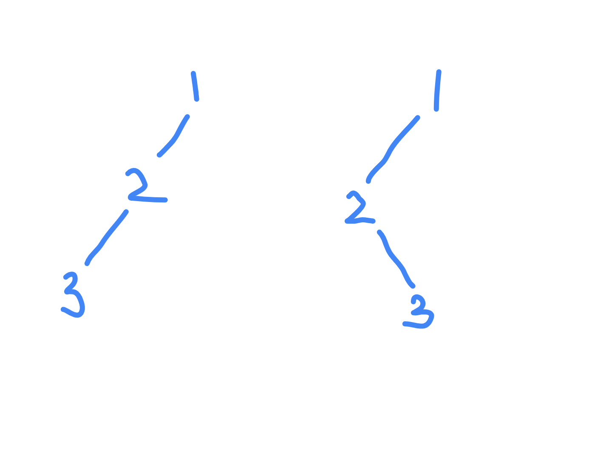
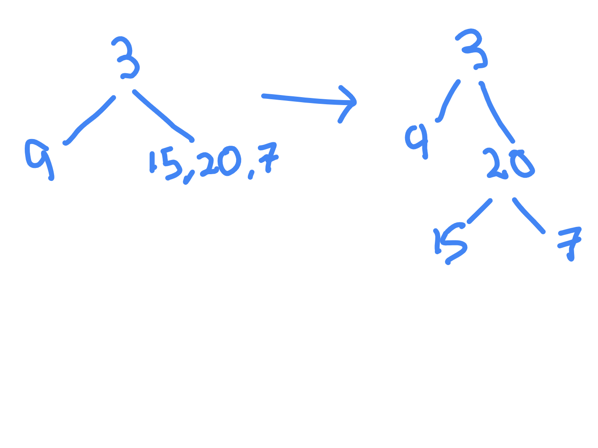

# Requirements Needed to Construct a Unique Binary Tree

- e.g. if pre order is 1, 2, 3 and post order is 3, 2, 1 



- however, if we are given an in order and a pre order - we can conclude that we can construct a unique binary tree
- e.g. in order is 9, 3, 15, 20, 7 and pre order is 3, 9, 20, 15, 7
- pre order starts with root, so root will be 3
- in order does left root right, so 9 is on left, 15, 20, 7 are on right
- again, solving for right subtree - we have 15 20 7 on right, and 20 comes first, so root is 20, and rest are left and right



- so, in order + (pre order / post order) - unique binary tree is possible
- so, pre order + post order - unique binary tree is NOT possible
- https://www.geeksforgeeks.org/problems/unique-binary-tree-requirements

```java
class Solution {
    
    public static boolean isPossible(int a, int b) {

        if (a > b) return isPossible(b, a);

        return (a == 1 && b == 2) || (a == 2 && b == 3);
    }
}
```
