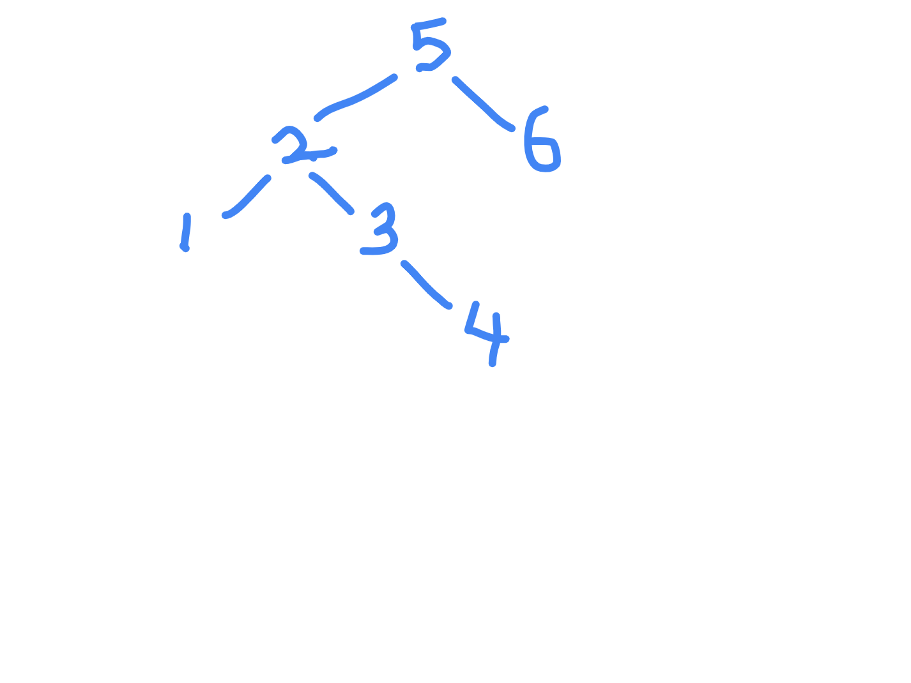
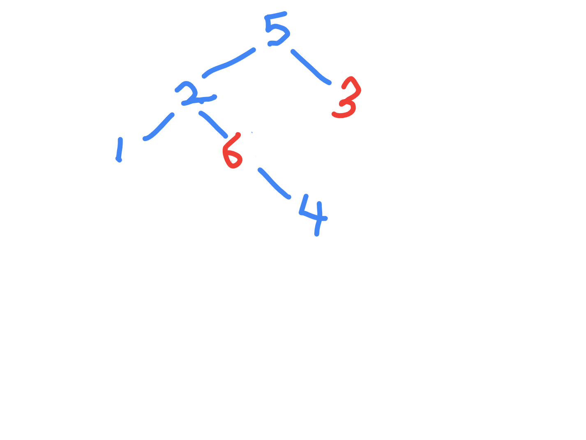
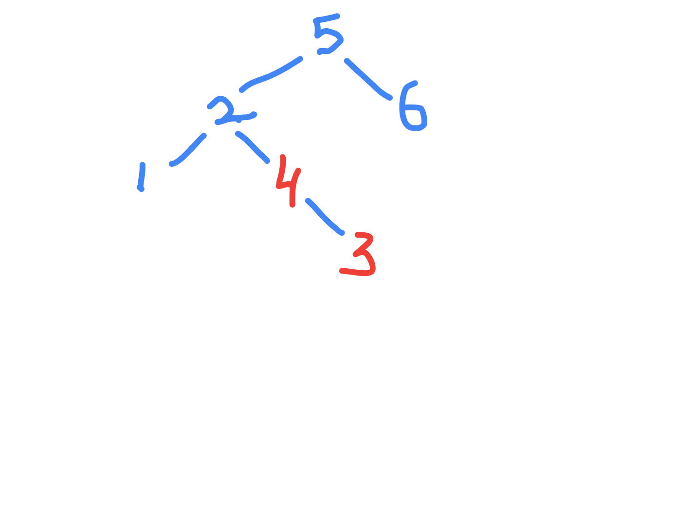

# Recover Binary Search Tree

- https://leetcode.com/problems/recover-binary-search-tree/
- brute - do an in order traversal
- correct the order - sort it or something
- finally, again traverse the tree in in order mode and update the values where needed
- time complexity - O(3 * N) (N to traverse, N to determine, N to fix), space complexity - O(N) to store the 
- optimal - time complexity O(N), space complexity - O(1)
- just perform an in order
- there are two cases - when the adjacent nodes are swapped, and distant nodes are swapped





- in order - 1 2 6 4 5 3 - 6 and 3 need to be swapped



- in order - 1 2 4 3 5 6 - 4 and 3 need to be swapped

```java
class Solution {

    private TreeNode lastNodeSeen;
    private TreeNode nodeBeforeFirstViolation;
    private TreeNode firstViolation;
    private TreeNode secondViolation;

    private int prevValue;

    public void recoverTree(TreeNode root) {
        prevValue = Integer.MIN_VALUE;
        inorder(root);
        if (secondViolation == null) {
            swap(nodeBeforeFirstViolation, firstViolation);
        } else {
            swap(nodeBeforeFirstViolation, secondViolation);
        }
    }

    private void swap(TreeNode a, TreeNode b) {
        a.val = a.val ^ b.val;
        b.val = a.val ^ b.val;
        a.val = a.val ^ b.val;
    }

    private void inorder(TreeNode root) {
        
        if (root == null) return;
        
        inorder(root.left);
        if (root.val < prevValue) {
            if (firstViolation == null) {
                nodeBeforeFirstViolation = lastNodeSeen;
                firstViolation = root;
            } else {
                secondViolation = root;
            }
        }
        lastNodeSeen = root;
        prevValue = root.val;
        
        inorder(root.right);
    }
}
```
