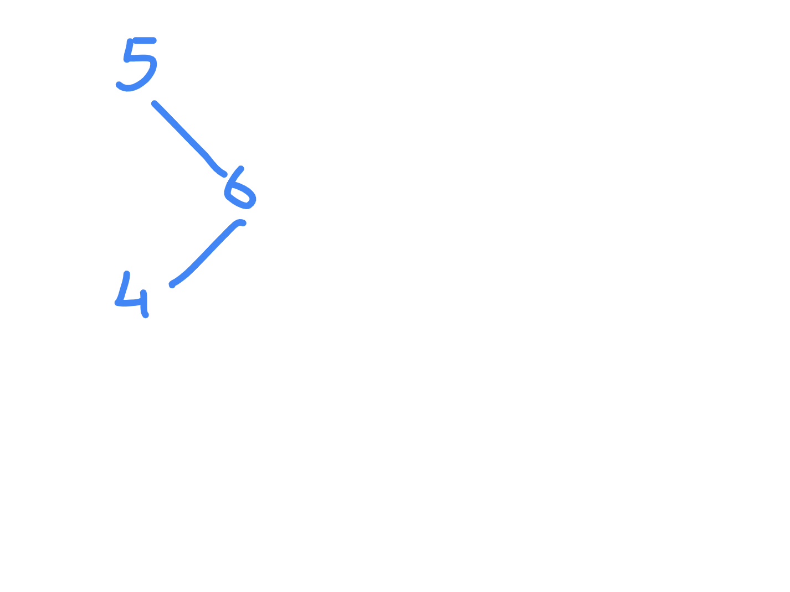

# Validate Binary Search Tree

- https://leetcode.com/problems/validate-binary-search-tree/
- just checking immediate left or right is not enough
- e.g. 4 is to the right of 5



- so, we recursively check if element is inside specified bounds
- test cases also include duplicate values, which is not a valid bst
- note - question uses full bounds of integer, so we cannot chicken out by simply thinking integer.max_value and integer.min_value are exclusive bounds
- the more complex way - i track via booleans if bounds are inclusive or exclusive

```java
class Solution {

    public boolean isValidBST(TreeNode root) {
        return isValidBST(root, Integer.MIN_VALUE, Integer.MAX_VALUE, true, true);
    }

    private boolean isValidBST(TreeNode root, int leftBound, int rightBound, boolean includeLeftBound, boolean includeRightBound) {
        
        if (root == null) return true;

        if (includeLeftBound && root.val < leftBound) return false;
        if (!includeLeftBound && root.val <= leftBound) return false;

        if (includeRightBound && root.val > rightBound) return false;
        if (!includeRightBound && root.val >= rightBound) return false;
        
        return isValidBST(root.left, leftBound, root.val, includeLeftBound, false) && isValidBST(root.right, root.val, rightBound, false, includeRightBound);
    }
}
```

- the easy way - pass long as bounds, and make them int.max_value + 1 and int.min_value - 1. this way, bounds will always be exclusive

```java
class Solution {

    public boolean isValidBST(TreeNode root) {
        return isValidBST(root, Integer.MIN_VALUE - 1L, Integer.MAX_VALUE + 1L);
    }

    private boolean isValidBST(TreeNode root, long leftBound, long rightBound) {
        
        if (root == null) return true;

        if (root.val <= leftBound || root.val >= rightBound) return false;
        
        return isValidBST(root.left, leftBound, root.val) && isValidBST(root.right, root.val, rightBound);
    }
}
```
