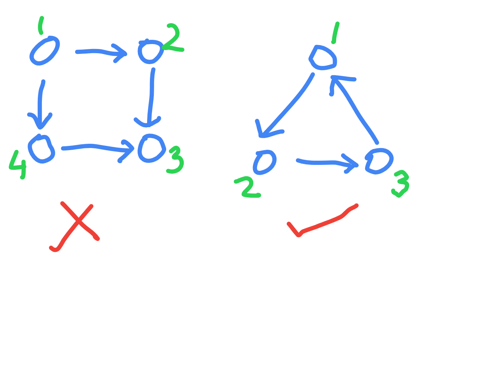

# Cycle Detection in Directed Graph (DFS)

- https://www.codingninjas.com/studio/problems/detect-cycle-in-a-directed-graph-_920545
- what is a cycle in a directed graph - first one is not a cycle, second one is



- so, unlike [this](./Detect%20Cycle%20in%20an%20Undirected%20Graph.md), we cannot say that there is a cycle if we visit a node twice (4th node of example 1)
- so for dfs, the idea is to visit the node again "on the same path"
- if we look at recursive call for 1st example - 1 -> 2 -> 3 -> backtrack to 2 -> backtrack to 1 -> 4 -> 3
- so, 3 came on a "different path"
- recursive call for 2nd example - 1 -> 2 -> 3 -> again 1

```java
import java.util.*;

public class Solution {

    public static Boolean isCyclic(int[][] edges, int v, int e) {

        List<List<Integer>> adj = new ArrayList<>();

        for (int node = 0; node < v; node++) {
            adj.add(new ArrayList<>());
        }

        for (int[] edge : edges) {
            adj.get(edge[0]).add(edge[1]);
        }

        boolean[] vis = new boolean[v];
        boolean[] currentVis = new boolean[v];

        for (int node = 0; node < v; node++) {

            if (!vis[node]) {

                vis[node] = true;
                currentVis[node] = true;

                if (isCyclic(vis, currentVis, adj, node)) {
                    return true;
                }

                currentVis[node] = false;
            }
        }

        return false;
	}

    private static boolean isCyclic(boolean[] vis, boolean[] currentVis, List<List<Integer>> adj, int node) {

        for (int neighbor : adj.get(node)) {

            if (vis[neighbor] && currentVis[neighbor]) {
                return true;
            } else if (vis[neighbor]) {
                continue;
            } else {
                vis[neighbor] = true;
                currentVis[neighbor] = true;
                if (isCyclic(vis, currentVis, adj, neighbor)) {
                    return true;
                }
                currentVis[neighbor] = false;
            }
        }

        return false;
    }
}
```
