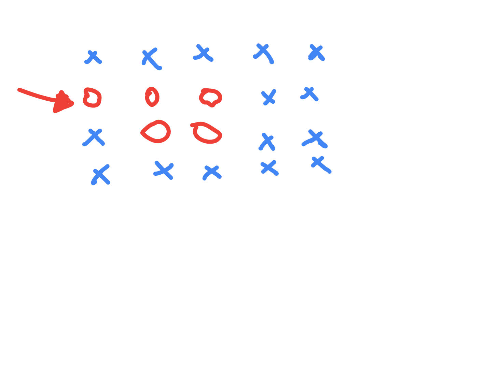

# Surrounded Regions

- https://leetcode.com/problems/surrounded-regions/
- observation - if the set of 0s in question has a 0 attached to any boundary somehow, they cannot be converted to X
- this is because "that boundary" will not be enclosed by X



- so, we start from all the 0s on boundaries, and mark all the 0s that are connected to it as "cannot be converted"
- all remaining 0s can be converted to X
- we can do dfs or bfs
- time complexity - n*m
- first, i convert all Os that cannot be converted to #
- finally, i convert all #s to Os and anything else to Xs
- [here](./Number%20of%20Enclaves.md), i check the condition that when adding boundaries, only add for e.g. both top and bottom boundary if there are > 1 rows, did not bother performing that check in this question though

```java
class Solution {

    private static final int[][] directions = new int[][]{
        new int[]{1, 0},
        new int[]{-1, 0},
        new int[]{0, 1},
        new int[]{0, -1}
    };

    private char[][] board;
    private int rows;
    private int cols;

    public void solve(char[][] board) {

        this.board = board;
        this.rows = board.length;
        this.cols = board[0].length;

        solve();
    }

    private void solve() {
        
        for (int i = 0; i < rows; i++) {
            if (board[i][0] == 'O') {
                board[i][0] = '#';
                dfs(i, 0);
            }
            if (board[i][cols - 1] == 'O') {
                board[i][cols - 1] = '#';
                dfs(i, cols - 1);
            }
        }

        for (int i = 0; i < cols; i++) {
            if (board[0][i] == 'O') {
                board[0][i] = '#';
                dfs(0, i);
            }
            if (board[rows - 1][i] == 'O') {
                board[rows - 1][i] = '#';
                dfs(rows - 1, i);
            }
        }

        for (int i = 0; i < rows; i++) {
            for (int j = 0; j < cols; j++) {
                board[i][j] = board[i][j] == '#' ? 'O' : 'X';
            }
        }
    }

    private void dfs(int r, int c) {
        for (int[] direction : directions) {
            int newR = r + direction[0];
            int newC = c + direction[1];
            if (isValid(newR, newC) && board[newR][newC] == 'O') {
                board[newR][newC] = '#';
                dfs(newR, newC);
            }
        }
    }

    private boolean isValid(int r, int c) {
        return r > -1 && c > -1 && r < rows && c < cols;
    }
}
```
