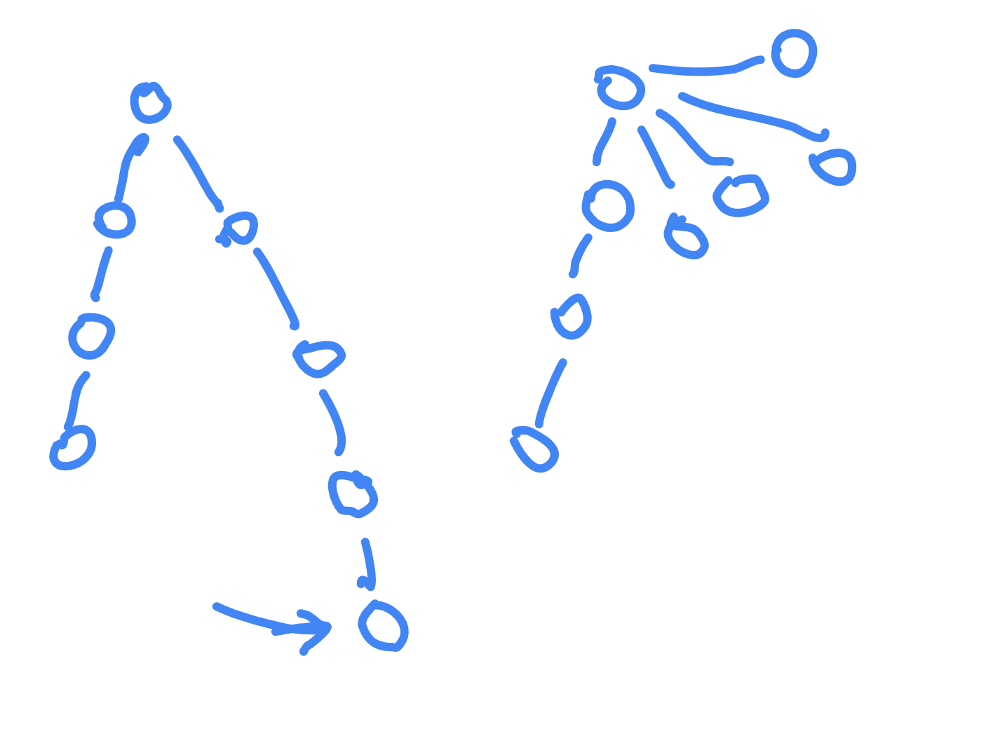
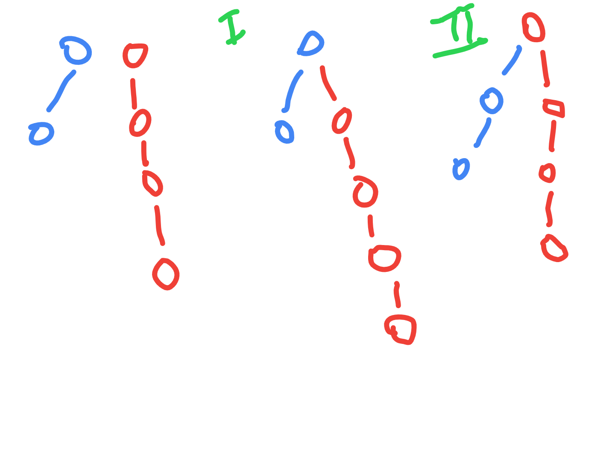

# Disjoint Set

- assume we are given a graph with multiple components
- queries are of the form p,q - are p and q in the same component
- we can do bfs / dfs to find [components](../Step%2015.1:%20Learning/Number%20of%20Provinces.md)
- use disjoint sets - it can answer this in constant time, and can accommodate for "changing graphs"
- two methods - union by rank and union by size
- it also has a parent method
- when we give it an edge - it will connect the two nodes
- we will add edges on the fly, and we can answer queries like are two nodes part of the same component on the fly
- two arrays - rank and parent
- initially - every node is its own parent, i.e. `parent[i] = i`
- union(u, v) - 
  - find ultimate parents (say pu and pv)
  - find rank of pu and pv
  - connect smaller rank to larger rank always
  - accordingly modify parent and rank arrays
- findParent - find ultimate parent
- this operation is right now logN
- path compression - when finding ultimate parent, update parent of intermediary nodes to point directly to ultimate parent
- this way, jump can be direct now
- so, the next find parent becomes constant time complexity
- why can we not update rank to 1 when finding parent and applying path compression?
- because path compression gets applied to only one branch - e.g. below, left branch stays the same



- final complexity is something like 4 alpha (near constant)
- why connect larger to smaller rank - this way, rank stays the same
- this is why, if ranks are same, we need to increment the rank by one!



- union by size - just use size instead. feels more intuitive / easy to follow, since ranks get distorted after path compression etc
- basically, smaller size will get added to larger size
- both have time complexities 4 * alpha i.e. near constant
- https://www.geeksforgeeks.org/problems/union-find/1
- remember implementation of union - if rank is lesser, call with reverse arguments, else perform the assignment and increment rank

```java
class Solution {

    public void union_(int a, int b, int par[], int rank[]) {

        int parentA = findParent(a, par);
        int parentB = findParent(b, par);

        if (rank[parentA] < rank[parentB]) {
            union_(b, a, par, rank);
        } else {
            par[parentB] = parentA;
            if (rank[parentA] == rank[parentB]) {
                rank[parentA] += 1;
            }
        }
    }
    
    private int findParent(int a, int par[]) {
        if (par[a] == a) {
            return a;
        }
        par[a] = findParent(par[a], par);
        return par[a];
    }

    public Boolean isConnected(int a, int b, int par[], int rank[]) {
        int parentA = findParent(a, par);
        int parentB = findParent(b, par);
        return parentA == parentB;
    }
}
```
