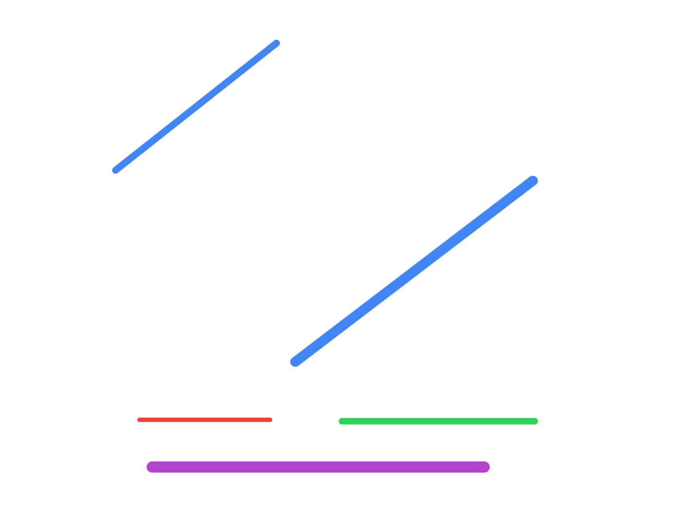

# Search in Rotated Sorted Array I

- brute force - linear search
- optimal - binary search
- memorize the conditions - i have used the same conditions to solve all sorted + rotated problems
- working principal - think of this diagram as the rotated array
- key note - "array has distinct values"



- the range is entirely on the left line - everything is good, we can do normal binary search
- the range is entirely on the right line - everything is good, we can do normal binary search
- the range is in a combination of the two
  - compare the middle with the left
  - if left is smaller than the middle
    - right part is not sorted, but left part is sorted
    - if element is between low and mid - element is in left part
    - else, element is in right part
  - if left is bigger than the middle
    - left part is not sorted, but right part is sorted
    - if element is between mid and right - element is in right part
    - else, element is in left part
- https://leetcode.com/problems/search-in-rotated-sorted-array/
- i messed up because of not having `=` for `nums[low] <= nums[mid]`, the `=` there is important

```java
class Solution {
    
    public int search(int[] nums, int target) {
        
        int low = 0;
        int high = nums.length - 1;

        while (low <= high) {
            
            int mid = getMid(low, high);
            
            if (nums[mid] == target) {
                return true;
            }
            
            // subarray is sorted
            if (nums[low] < nums[high]) {

                // normal binary search
                if (nums[mid] > target) {
                    high = mid - 1;
                } else if (nums[mid] < target) {
                    low = mid + 1;
                }
            } else {

                // left part of subarray is sorted
                if (nums[low] <= nums[mid]) {
                    if (nums[low] <= target && target < nums[mid]) {
                        high = mid - 1;
                    } else {
                        low = mid + 1;
                    }
                }
                
                // right part of subarray is sorted
                else {
                    if (nums[mid] < target && target <= nums[high]) {
                        low = mid + 1;
                    } else {
                        high = mid - 1;
                    }
                }
            }
        }

        return -1;
    }

    private int getMid(int low, int high) {
        return low + ((high - low) / 2);
    }
}
```
