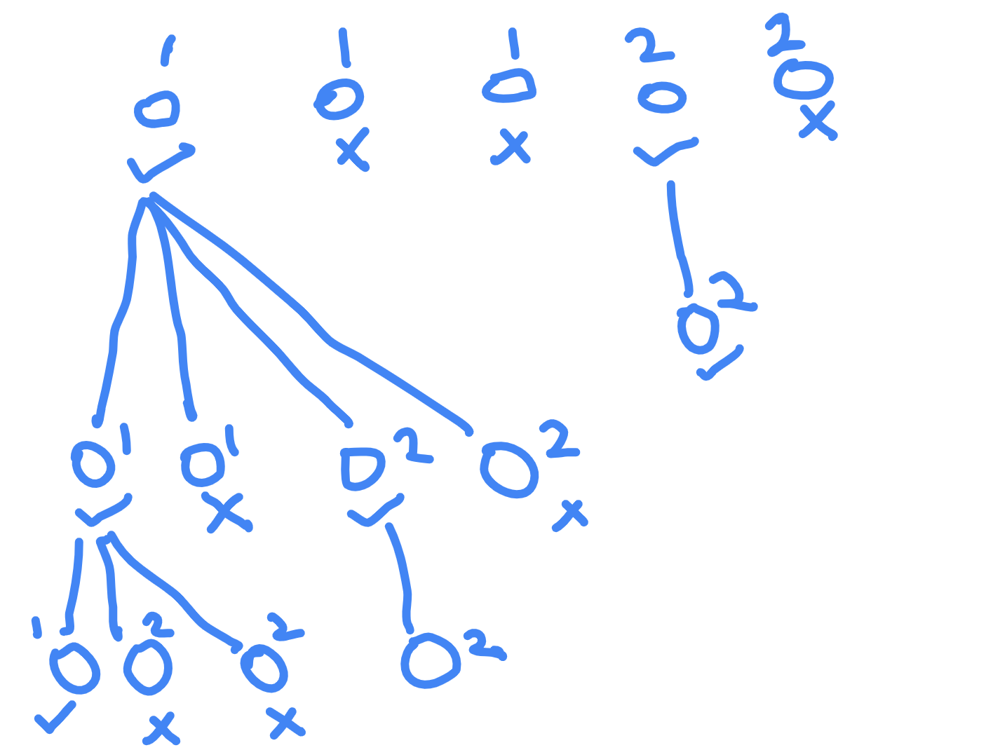

# Combination Sum II

- https://leetcode.com/problems/combination-sum-ii/
- naive - generate all subsequences (pick or do not pick an element), use set to dedupe lists i.e. same subsequences, sort list at end before adding to the set
- optimized - sort array first (make a copy for leaving input untouched) - this way we ensure sorted
- now, assume array is of form `[1, 1, 1, 2, 2]`
- when choosing the current element for the subsequence, we only need to select the first 1st 1 or 1st 2 i.e. no point of ignoring the 1st 1 and selecting the second 1 - we end up generating duplicates this way
- so, for 1, 4 combinations are there - no 1s, 1, 1 1, 1 1 1. so, for all the last 3 cases, we always use the first 1
- this way, we ensure unique subsequences
- at every step, we try picking the element all elements between startIdx to end
- if we pick an element, we try generating all subsequences such that the next element can be anything from that idx + 1 to the end of the list

```java
class Solution {
    
    public List<List<Integer>> combinationSum2(int[] _candidates, int target) {
        
        int[] candidates = Arrays.copyOfRange(_candidates, 0, _candidates.length);
        Arrays.sort(candidates);
        List<List<Integer>> result = new ArrayList<>();
        recurse(result, candidates, 0, target, new ArrayList<>());
        return result;
    }

    private void recurse(List<List<Integer>> result, int[] candidates, int startIdx, int target, List<Integer> currentPick) {

        for (int i = startIdx; i < candidates.length; i++) {

            if (i != startIdx && candidates[i] == candidates[i - 1]) continue;
            if (candidates[i] > target) continue;

            currentPick.add(candidates[i]);
            if (target == candidates[i]) {
                result.add(new ArrayList<>(currentPick));
            } else {
                recurse(result, candidates, i + 1, target - candidates[i], currentPick);
            }
            currentPick.remove(currentPick.size() - 1);
        }
    }
}
```


