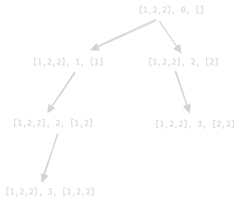

# Subsets II

- https://leetcode.com/problems/subsets-ii/
- intuition explained inside [Combination Sum II](./Combination%20Sum%20II.md)
- vvipmp - recursion tree - this pattern can be tricky to come up with in interview, remember this as is



```java
class Solution {
    
    public List<List<Integer>> subsetsWithDup(int[] _nums) {
        
        int[] nums = Arrays.copyOfRange(_nums, 0, _nums.length);
        Arrays.sort(nums);
        List<List<Integer>> result = new ArrayList<>();
        recurse(result, nums, 0, new ArrayList<>());
        return result;
    }

    void recurse(List<List<Integer>> result, int[] nums, int startIdx, List<Integer> pick) {
        
        result.add(new ArrayList<>(pick));

        for (int i = startIdx; i < nums.length; i++) {
            if (i != startIdx && nums[i] == nums[i - 1]) continue;
            pick.add(nums[i]);
            recurse(result, nums, i + 1, pick);
            pick.remove(pick.size() - 1);
        }
    }
}
```

## Solution 2

```java
class Solution {

    public List<List<Integer>> subsetsWithDup(int[] nums) {
        Arrays.sort(nums);
        List<List<Integer>> result = new ArrayList<>();
        recurse(nums, nums.length, result, 0, new ArrayList<>());
        return result;
    }

    private void recurse(int[] nums, int n, List<List<Integer>> result, int idx, List<Integer> current) {
        
        if (idx == n) {
            result.add(new ArrayList<>(current));
            return;
        }

        int currentElement = nums[idx];
        
        int end = idx;
        
        while (end < n && nums[end] == nums[idx]) {
            end += 1;
        }

        recurse(nums, n, result, end, current);

        for (int i = idx; i < end; i++) {
            current.add(nums[i]);
            recurse(nums, n, result, end, current);
        }

        for (int i = idx; i < end; i++) {
            current.remove(current.size() - 1);
        }
    }
}
```
