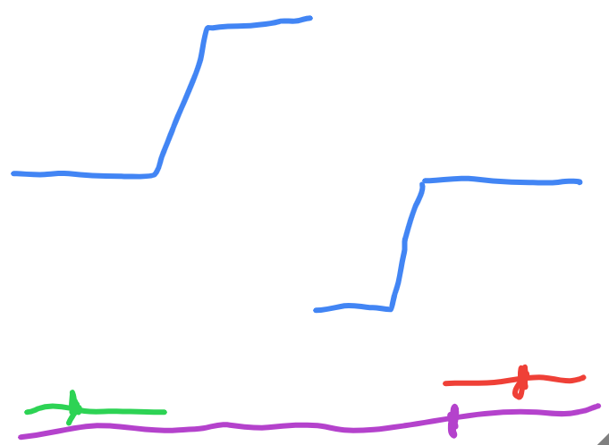

# Search in Rotated Sorted Array II

- https://leetcode.com/problems/search-in-rotated-sorted-array-ii/
- almost same as [Search in Rotated Sorted Array I](./Search%20in%20Rotated%20Sorted%20Array%20I.md)
- the only problem is when `nums[low] = nums[mid] = nums[high]`
- reason - below diagram - all three ranges described below are possible (mid is marked), and we cannot tell which one it is



- so, we reduce by one on each side in this case
- time complexity - can go up to O(n) in worst cases
- again memorize this extra condition - can be used to solve all duplicate related problems

```java
class Solution {
    public boolean search(int[] nums, int target) {
        
        int low = 0;
        int high = nums.length - 1;

        while (low <= high) {
            
            int mid = getMid(low, high);

            if (nums[mid] == target) {
                return mid;
            }

            // equal
            else if (nums[low] == nums[mid] && nums[mid] == nums[high]) {
                low += 1;
                high -= 1;
            }

            // subarray is sorted
            else if (nums[low] < nums[high]) {
                if (nums[mid] > target) {
                    high = mid - 1;
                } else {
                    low = mid + 1;
                }
            }

            else {
                // left part of subarray is sorted
                if (nums[low] <= nums[mid]) {
                    if (nums[low] <= target && target < nums[mid]) {
                        high = mid - 1;
                    } else {
                        low = mid + 1;
                    }
                }

                // right part of subarray is sorted
                else {
                    if (nums[mid] < target && target <= nums[high]) {
                        low = mid + 1;
                    } else {
                        high = mid - 1;
                    }
                }
            }
        }

        return false;
    }

    private int getMid(int low, int high) {
        return low + ((high - low) / 2);
    }
}
```
