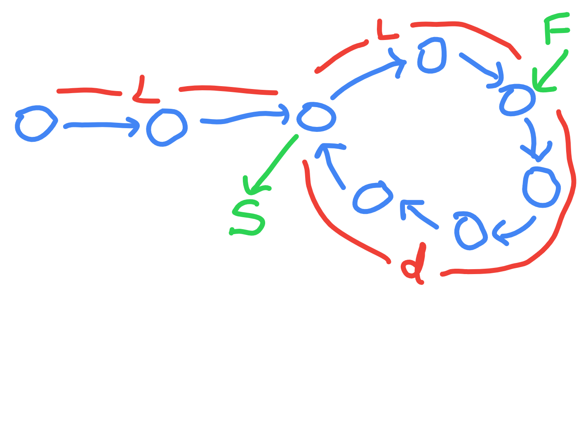
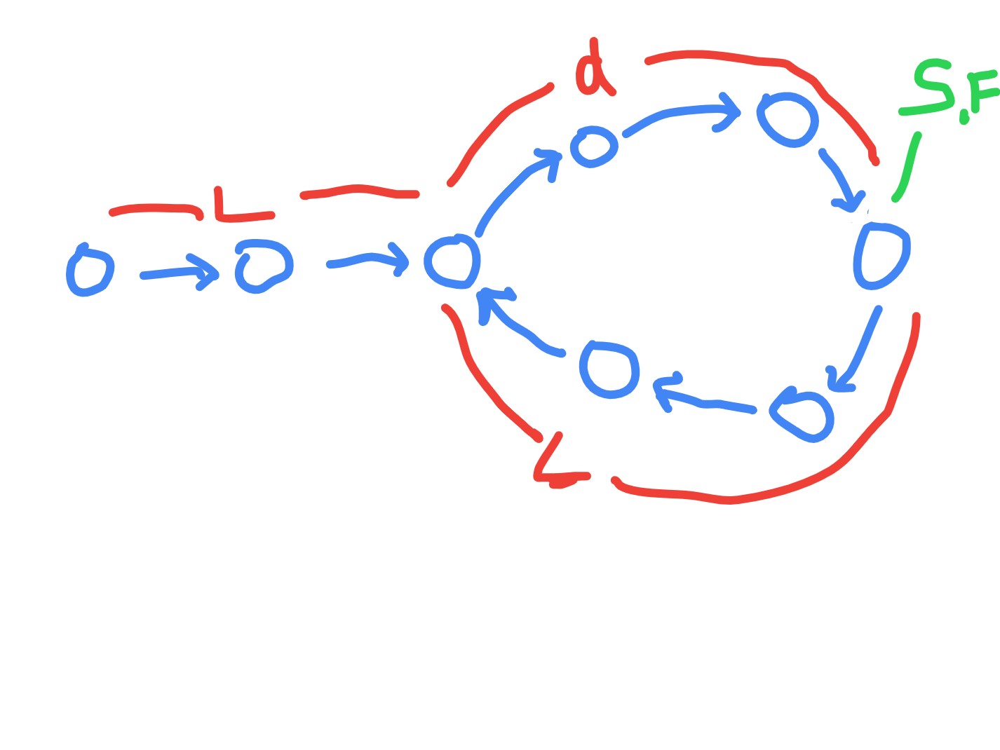

# Find the starting point in LL

## Brute

- use a set - the key is instance address
- when the element is found, return it

```java
public class Solution {

    public ListNode detectCycle(ListNode head) {

        Set<ListNode> set = new HashSet<>();
        ListNode current = head;
        
        while (current != null) {
            if (set.contains(current)) return current;
            set.add(current);
            current = current.next;
        }

        return null;
    }
}
```

## Optimal

- tortoise and hare algorithm
- first part is the same as [Detect a loop in LL](./Detect%20a%20loop%20in%20LL.md)
- then, we reset slow to head and and move both fast and slow one by one
- finally, they meet at the starting point
- assume head to start of loop is L
- when slow reaches start of loop, fast is L distance more inside loop away from this start
- let us say distance between slow and fast in other direction is d
- this way, the entire circle is d + L



- they meet after d steps - distance d is decreasing by one since fast moves twice as fast as slow
- so, while fast covers 2d, slow covers d till they meet
- so actually, they meet at distance d from start of loop
- recall circle was d + L
- so, distance between meeting point and back to start again is L



- so on resetting slow to head
- slow has to move L to reach starting point, fast also has to move L to reach starting point
- note we will move both one by one this time around

```java
public class Solution {
    
    public ListNode detectCycle(ListNode head) {
        
        if (head == null || head.next == null) return null;

        ListNode fast = head;
        ListNode slow = head;

        do {
            fast = fast.next.next;
            slow = slow.next;
        } while (fast != null && fast.next != null && fast != slow);

        if (fast == null || fast.next == null) return null;

        slow = head;
        while (fast != slow) {
            fast = fast.next;
            slow = slow.next;
        }

        return slow;
    }
}
```
